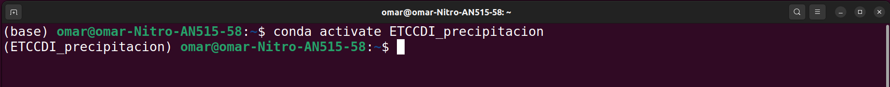
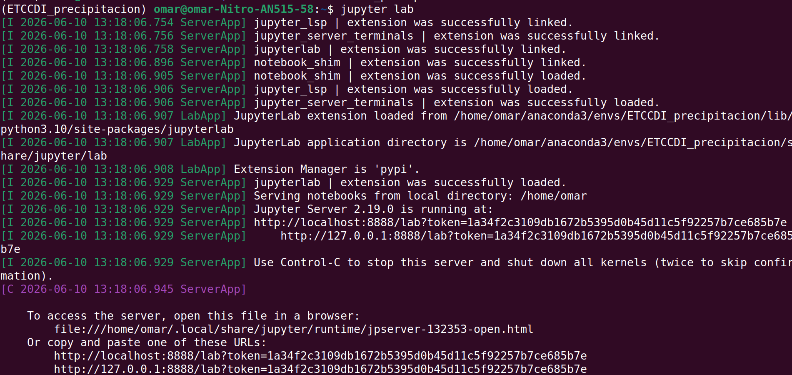
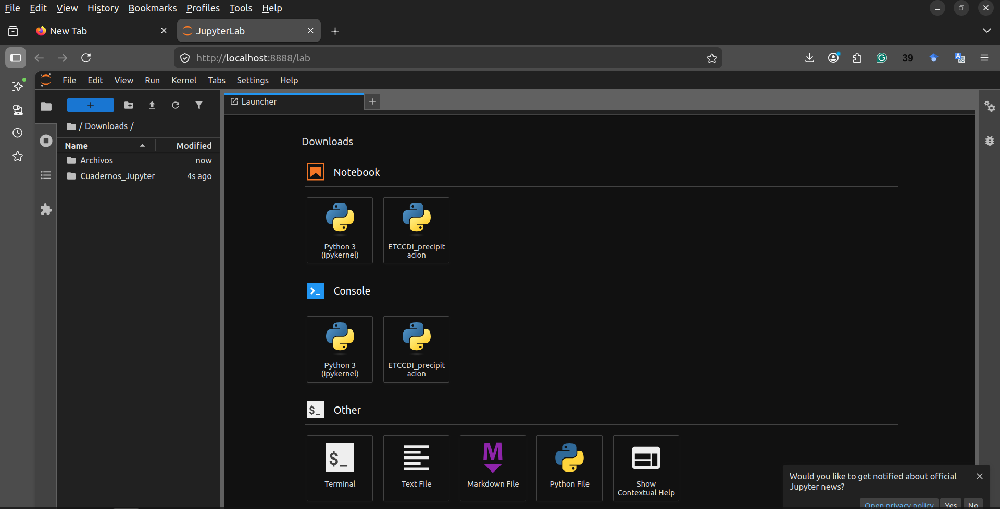

# Pasos a seguir para replicar ejemplos


1) Descarga el cuaderno Jupyter (.ipynb) de la categoría de índices ETCCDI precipitación de tu interés.
   Secciones:
     - Procesamiento de datos [Ejemplos](Indice.md)
     - Graficamiento de datos [Ejemplos](Indice.md)

  
2) En una nueva Anaconda prompt o terminal, activar el entorno "ETCCDI_precipitacion"

```
conda activate ETCCDI_precipitacion
```




2) Sin salir del anaconda prompt, activar "jupyter lab"

```
jupyter lab
```



<br>

Automáticamente se abrirá una ventana en el navegador.




3) En el lanzador, activar el kernel "ETCCDI_precipitacion"


